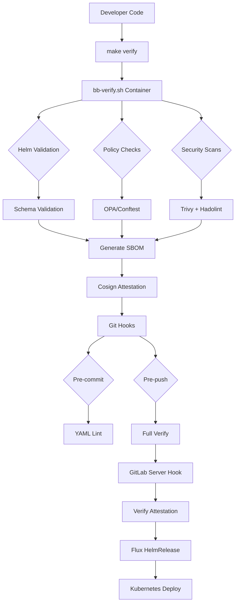

# P1 Dev Guard Architecture

## Overview

P1 Dev Guard implements a "pipeline-in-a-box" approach that brings Platform One / Big Bang compliance validation to the developer's local environment, enabling rapid feedback without requiring CI/CD infrastructure.

## Flow Diagram

## Components

### 1. Local Verification Engine (`bb-verify.sh`)

Containerized verification that runs all compliance checks:

- **Helm Validation**: Chart linting, template rendering, schema validation
- **Policy Enforcement**: OPA rules for images, operations, network, pod security
- **Security Scanning**: Trivy for vulnerabilities, Hadolint for Dockerfile best practices
- **Supply Chain**: SBOM generation with Syft, cryptographic attestation with cosign

### 2. Git Integration Layer

Multi-level git hooks providing progressive validation:

- **Pre-commit**: Fast checks (YAML syntax, schema existence)
- **Pre-push**: Full verification suite (calls bb-verify.sh)
- **Server-side**: Attestation verification on protected branches

### 3. Policy Framework

Modular OPA/Rego policies aligned with Big Bang requirements:

- `images.rego`: Iron Bank mirror enforcement, digest pinning, no latest tags
- `ops.rego`: Resource limits, health probes, security contexts
- `network.rego`: NetworkPolicy requirements, service mesh integration
- `podsecurity.rego`: Pod Security Standards, capabilities restrictions

### 4. Brownfield Adapter

Helm chart wrapper that parameterizes existing Kubernetes manifests:

- Minimal disruption to existing applications
- Progressive migration path to full Big Bang compliance
- Values schema enforcement for type safety and documentation

### 5. Development Environment

Complete development environment with:

- **DevContainer**: Pre-configured environment with all tools and certificates
- **VS Code Integration**: Tasks, problem matchers, IntelliSense for policies
- **AI Assistant Rules**: Guidelines for AI-assisted development aligned with P1 standards

## Data Flow

### Artifacts Generated

1. **SBOM**: `artifacts/sbom/<commit>.spdx.json` - Software Bill of Materials
2. **Attestation**: `artifacts/attestations/<commit>.intoto.jsonl` - Signed compliance attestation
3. **Reports**: `artifacts/reports/<commit>.json` - Detailed verification results

### Air-gapped Considerations

- All tools packaged in container images
- Local policy bundles, no external fetching
- Graceful degradation when cloud services unavailable
- Manual artifact transfer workflows for compliance evidence

## Security Model

### Trust Chain

1. **Developer Workstation**: Local signing key for development attestations
2. **Container Images**: Verified base images from Iron Bank registry
3. **Policy Bundle**: Signed OPA policies distributed via S3
4. **Server Hooks**: Cryptographic verification of all pushed commits

### Offline Operation

- Container registry mirrors for all dependencies
- Local CA certificate trust store
- S3 bucket for policy distribution with offline fallback
- Local git hooks as primary enforcement mechanism

## Integration Points

### Big Bang Ecosystem

- **Flux CD**: HelmRelease CRD patterns matching Big Bang conventions
- **Istio Service Mesh**: NetworkPolicy rules compatible with mesh requirements
- **Monitoring**: Prometheus/Grafana compatibility checks
- **Logging**: FluentBit configuration validation

### Platform Services

- **GitLab**: Server-side hooks for centralized enforcement
- **Harbor/Registry**: Container image scanning integration
- **Vault**: Secret management patterns and policy validation
- **S3**: Artifact storage for compliance evidence and policy distribution

This architecture enables developers to validate Big Bang compliance continuously during development, reducing cycle time and ensuring applications meet security and operational requirements before deployment.